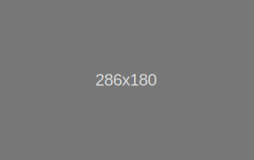

<y-scroll>

## Card 卡片
> 将信息聚合在卡片容器中展示。

### 默认

*Demo*

<y-row class="demo-card">
  <y-col :md="12">
    <y-card>
      
      <h5 class="card-title">Card title</h5>
      <p class="card-text">Some quick example text to build on the card title and make up the bulk of the card's content.</p>
      <a href="#" class="btn btn-primary">Go somewhere</a>
    </y-card>
  </y-col>
</y-row>

---

*Code*

```html
<y-card>
  
  <h5 class="card-title">Card title</h5>
  <p class="card-text">Some quick example text to build on the card title and make up the bulk of the card's content.</p>
  <a href="#" class="btn btn-primary">Go somewhere</a>
</y-card>
```

### Content types

*Demo*

<y-row class="demo-card">
  <y-col :md="12">
    <y-card>
      This is some text within a card body.
    </y-card>
  </y-col>
</y-row>

---

*Code*

```html
<y-card>
  This is some text within a card body.
</y-card>
```

### Titles, text, and links

*Demo*

<y-row class="demo-card">
  <y-col :md="12">
    <y-card>
      <h5 class="card-title">Card title</h5>
      <h6 class="card-subtitle mb-2 text-muted">Card subtitle</h6>
      <p class="card-text">Some quick example text to build on the card title and make up the bulk of the card's content.</p>
      <a href="#" class="card-link">Card link</a>
      <a href="#" class="card-link">Another link</a>
    </y-card>
  </y-col>
</y-row>

---

*Code*

```html
<y-card>
  <h5 class="card-title">Card title</h5>
  <h6 class="card-subtitle mb-2 text-muted">Card subtitle</h6>
  <p class="card-text">Some quick example text to build on the card title and make up the bulk of the card's content.</p>
  <a href="#" class="card-link">Card link</a>
  <a href="#" class="card-link">Another link</a>
</y-card>
```

### List groups

*Demo*

<y-row class="demo-card">
  <y-col :md="12">
    <y-card>
      <ul class="list-group list-group-flush" slot="card-inner">
        <li class="list-group-item">Cras justo odio</li>
        <li class="list-group-item">Dapibus ac facilisis in</li>
        <li class="list-group-item">Vestibulum at eros</li>
      </ul>
    </y-card>
  </y-col>
</y-row>
<y-row class="demo-card">
  <y-col :md="12">
    <y-card>
      <div slot="header">
        Featured
      </div>
      <ul class="list-group list-group-flush" slot="card-inner">
        <li class="list-group-item">Cras justo odio</li>
        <li class="list-group-item">Dapibus ac facilisis in</li>
        <li class="list-group-item">Vestibulum at eros</li>
      </ul>
    </y-card>
  </y-col>
</y-row>

---

*Code*

```html
<y-card>
  <ul class="list-group list-group-flush" slot="card-inner">
    <li class="list-group-item">Cras justo odio</li>
    <li class="list-group-item">Dapibus ac facilisis in</li>
    <li class="list-group-item">Vestibulum at eros</li>
  </ul>
</y-card>
<y-card>
  <div slot="header">
    Featured
  </div>
  <ul class="list-group list-group-flush" slot="card-inner">
    <li class="list-group-item">Cras justo odio</li>
    <li class="list-group-item">Dapibus ac facilisis in</li>
    <li class="list-group-item">Vestibulum at eros</li>
  </ul>
</y-card>
```

### Background and color

*Demo*

<y-row class="demo-card">
  <y-col :md="12">
    <y-card class="mb-3" bg="primary" :text-white="true">
      <div slot="header">Header</div>
      <h5 class="card-title">Primary card title</h5>
      <div class="card-text">Some quick example text to build on the card title and make up the bulk of the card's content.</div>
    </y-card>
    <y-card bg="info" :text-white="true">
      <div slot="header">Header</div>
      <h5 class="card-title">Primary card title</h5>
      <div class="card-text">Some quick example text to build on the card title and make up the bulk of the card's content.</div>
    </y-card>
  </y-col>
</y-row>

---

*Code*

```html
<y-card class="mb-3" bg="primary" :text-white="true">
  <div slot="header">Header</div>
  <h5 class="card-title">Primary card title</h5>
  <div class="card-text">Some quick example text to build on the card title and make up the bulk of the card's content.</div>
</y-card>
<y-card bg="info" :text-white="true">
  <div slot="header">Header</div>
  <h5 class="card-title">Primary card title</h5>
  <div class="card-text">Some quick example text to build on the card title and make up the bulk of the card's content.</div>
</y-card>
```

### Border

*Demo*

<y-row class="demo-card">
  <y-col :md="12">
    <y-card class="mb-3" border="primary" :text-white="true">
      <div slot="header">Header</div>
      <h5 class="card-title">Primary card title</h5>
      <div class="card-text">Some quick example text to build on the card title and make up the bulk of the card's content.</div>
    </y-card>
    <y-card border="info" :text-white="true">
      <div slot="header">Header</div>
      <h5 class="card-title">Primary card title</h5>
      <div class="card-text">Some quick example text to build on the card title and make up the bulk of the card's content.</div>
    </y-card>
  </y-col>
</y-row>

---

*Code*

```html
<y-card class="mb-3" bg="primary" :text-white="true">
  <div slot="header">Header</div>
  <h5 class="card-title">Primary card title</h5>
  <div class="card-text">Some quick example text to build on the card title and make up the bulk of the card's content.</div>
</y-card>
<y-card bg="info" :text-white="true">
  <div slot="header">Header</div>
  <h5 class="card-title">Primary card title</h5>
  <div class="card-text">Some quick example text to build on the card title and make up the bulk of the card's content.</div>
</y-card>
```

</y-scroll>

<script>
  export default {
    data () {
      return {

      }
    },
    methods: {

    }
  }
</script>

<style scoped>

</style>
